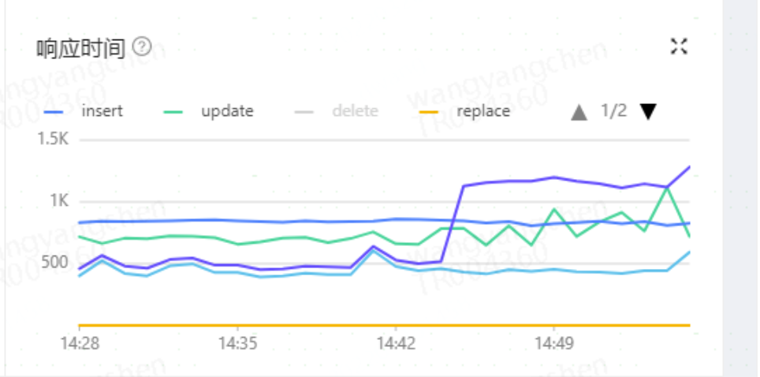
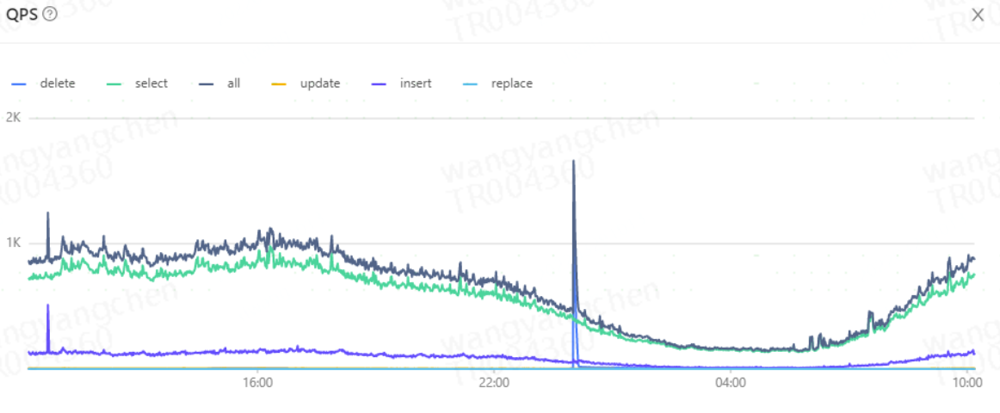

Mysql本身的不足：

1. MySQL 的 online DDL 带来的稳定性风险

2. 基于 binlog 复制的多节点读写分离会有数据一致性问题

3. 单表数据量承载能力有限，随着业务上升，消息表的数据量一直增加

OB优势：

1、因为 OB 的存储引擎使用了类 LSM Tree 设计，表的 scheme 也支持多个版本，所以在 在线DDL 已经不是问题，秒级即可完成并且不会锁表，可以放心的做此类操作。

2、使用优化的paxos协议结合物理日志复制保证多数派的数据一致性， 也就是三副本情况下强保证至少两个副本数据一致性，使用 OB 保证了 RTO＜30s，满足业务的数据一致性的要求。

3、以 IM 业务为例，我们群组消息表保存两个月数据占用存储空间800G 左右，基本触达当前配置下的 MySQL 单表上线；同样的数据迁移到 OB 后数据量在200G 左右。实际测试下来IM主库压缩率在1/3左右

4、OB是share nothing 架构，每个副本都是对等节点，多数派副本可以保持一致性，从根本上保证主备切换是一个安全的操作，系统宕机30s内可以自动发现和切换到具备完整数据的副本上，保证服务连续可用

OB的不足：

1、分区建的设计需要根据业务特性定义，开发需要根据业务设计合理的分区建，否则会影响查询性能

2、OB合并刷盘机制（会在业务低峰期，可配置）会影响插入和查询时间，大概10ms左右

Mysql和OB部署架构图

1、Mysql MHA Cluster部署

2、OB三机房部署

相关压测性能数据指标

1. Mysql集群和ob集群分别通过 sysbench 导入 16 张表，每张表有 1000 万行数据。

| **read_write** | **mysql 5.7.23** | **ob(16**张表都在单机房）** | **ob(16**张表部署在双机房）** | **ob(16**张表部署在三机房）** |         |                      |         |                      |
| -------------- | ---------------- | --------------------------- | ----------------------------- | ----------------------------- | ------- | -------------------- | ------- | -------------------- |
| **Threads**    | **QPS**          | **95%  latency (ms)**       | **QPS**                       | **95%  latency (ms)**         | **QPS** | **95% latency (ms)** | **QPS** | **95% latency (ms)** |
| 150            | 78268.66         | 45.79                       | 76760                         | 49                            | 92685   | 40                   | 89922   | 40                   |
| 300            | 85187.99         | 101.13                      | 85336                         | 124                           | 121662  | 86                   | 145456  | 66                   |
| 600            | 87068.84         | 569.67                      | 104655                        | 184                           | 137061  | 168                  | 177557  | 93                   |
| 1200           | 91627.88         | 977.74                      | 115891                        | 277                           | 146951  | 308                  | 197960  | 241                  |
| 1500           | 85861.23         | 1235.62                     | 113291                        | 387                           | 149243  | 430                  | 202863  | 349                  |

2、对比结果分析：

对于混合读写的情况，在并发超过100以上时OB部署多机房的qps高于MySQL，响应时间和MySQL差不多，随着并发数量增加，OB的qps提升明显，响应时间也比Mysql低很多。

目前线上的性能指标

1、需要通过OCP（OB的监控管理工具）监控，目前还没有和hickwall打通

2、响应时间（单位us）基本在1ms左右

1、业务迁移

迁移原则：

数据完整性和准确：保证数据不丢、不错；

迁移平滑和迅速：服务敏感度，不停服；

可回滚：遇到问题可随时切回mysql

1）数据同步

应用双写同步mysql数据到ob集群，DBA按照时间戳去对比mysql和ob两边数据的一致性，做数据一致性校验

2）读写验证

验证应用访问MYSQL和OB集群可以得到相同的结果，验证业务访问的准确性

可以根据业务需要迁移部分读流量到OB 集群

3）灰度切换

调整双写开发

将部分非核心业务的库表写操作迁移至OB集群，并双写至MYSQL，保证出问题，随时回滚

当业务访问长时间正常，可以增加切换流量，进行灰度切换，建议观察一段时间，至少一个月

4）迁移完成

流量全部迁移完成，继续保持OB集群反向同步至MYSQL，继续观察一段时间，没有问题后，关闭反向双写

迁移完成